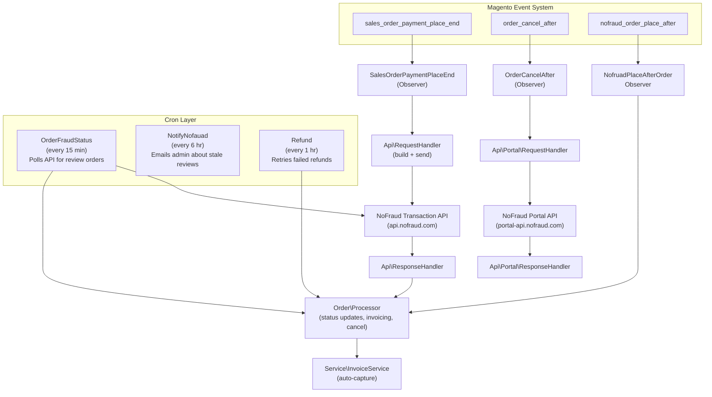
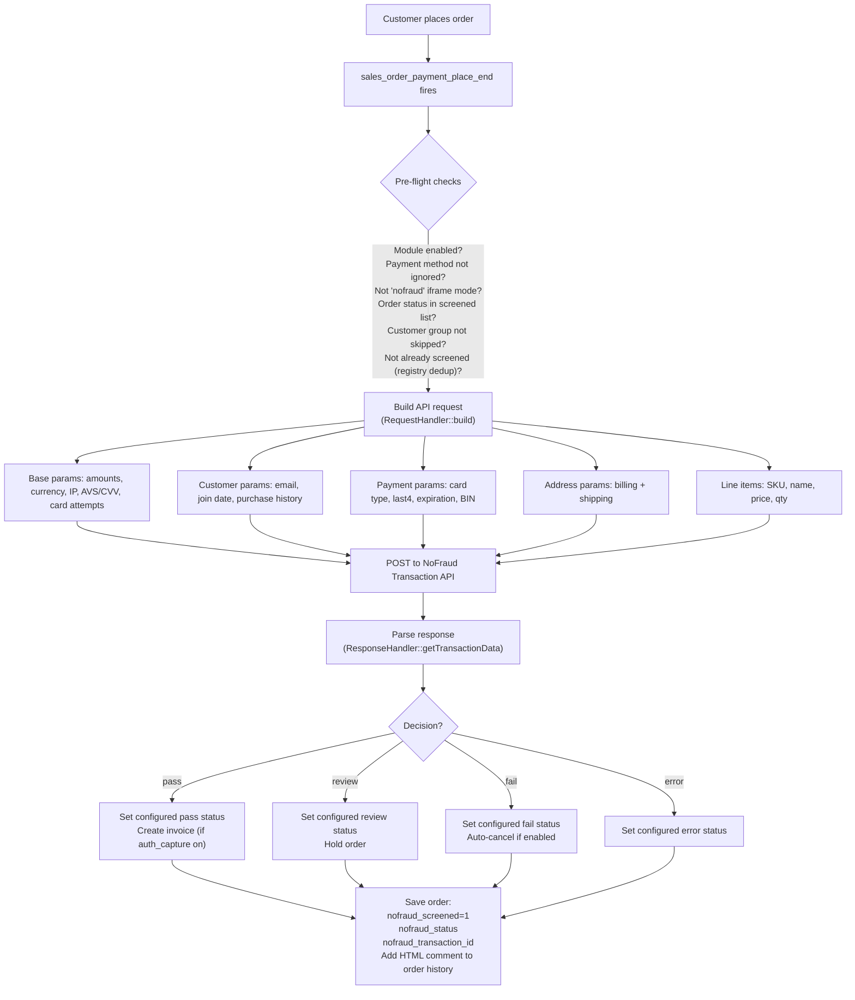
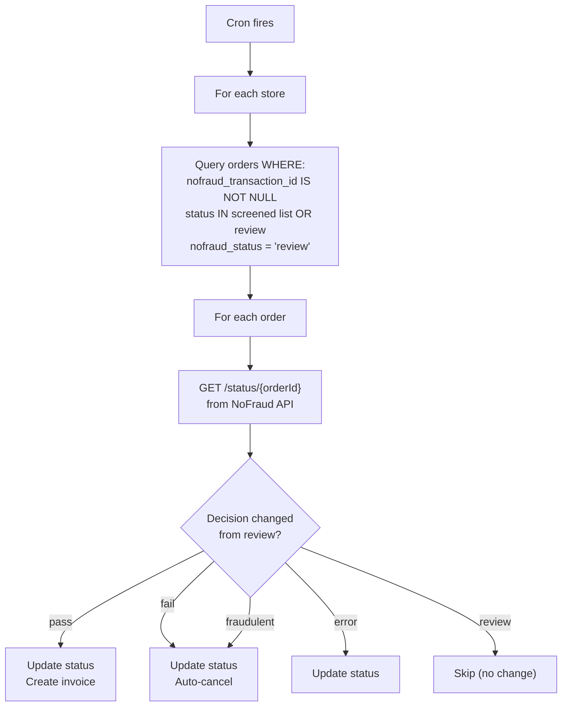
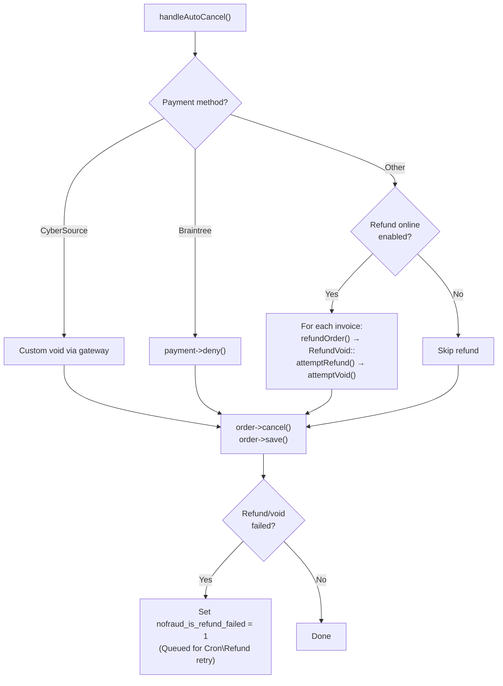
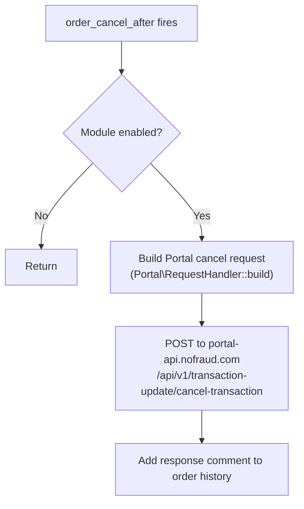
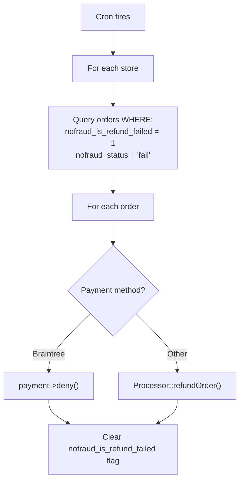

# NoFraud Connect (M2) - Technical Documentation

> **Module:** `NoFraud_Connect` | **Composer:** `nofraud/connect` | **Version:** 1.7.0  
> **PHP:** >=7.0.1 | **Framework:** Magento 2 (>=100.1.0)

## Table of Contents

- [Overview](#overview)
- [Architecture](#architecture)
- [Directory Structure](#directory-structure)
- [Database Schema](#database-schema)
- [Configuration Reference](#configuration-reference)
- [Order Lifecycle & Fraud Screening Flow](#order-lifecycle--fraud-screening-flow)
  - [Checkout Screening](#1-checkout-screening)
  - [Review Polling (Cron)](#2-review-polling-cron)
  - [Auto-Cancel & Refund](#3-auto-cancel--refund)
  - [Order Cancellation Notification](#4-order-cancellation-notification)
  - [Review Email Notifications](#5-review-email-notifications)
  - [Refund Retry (Cron)](#6-refund-retry-cron)
- [API Layer](#api-layer)
  - [NoFraud Transaction API](#nofraud-transaction-api)
  - [NoFraud Portal API](#nofraud-portal-api)
  - [Request Building](#request-building)
  - [Response Handling](#response-handling)
- [Payment Method Integrations](#payment-method-integrations)
- [Cron Jobs](#cron-jobs)
- [Event Observers](#event-observers)
- [Plugins (Interceptors)](#plugins-interceptors)
- [Admin UI Extensions](#admin-ui-extensions)
- [Logging](#logging)
- [Class Reference](#class-reference)
  - [Order/Processor](#orderprocessor)
  - [Helper/Config](#helperconfig)
  - [Helper/Data](#helperdata)
  - [Helper/OrderHelper](#helperorderhelper)
  - [Helper/RefundVoid](#helperrefundvoid)
  - [Helper/Version](#helperversion)
  - [Service/InvoiceService](#serviceinvoiceservice)
  - [Api/RequestHandler](#apirequesthandler)
  - [Api/ResponseHandler](#apiresponsehandler)
  - [Api/ApiUrl](#apiapiurl)
  - [Api/Request/Handler/AbstractHandler](#apirequesthandlerabstracthandler)
  - [Api/Portal/RequestHandler](#apiportalrequesthandler)
  - [Api/Portal/ResponseHandler](#apiportalresponsehandler)
  - [Api/Portal/ApiUrl](#apiportalapiurl)
  - [Observers](#observers)
  - [Plugins](#plugins)
  - [Cron Classes](#cron-classes)
  - [Model Config Sources](#model-config-sources)
  - [UI Components](#ui-components)
  - [Exceptions](#exceptions)
- [CI/CD & Release Process](#cicd--release-process)

---

## Overview

NoFraud Connect is a Magento 2 extension that integrates with the [NoFraud](https://www.nofraud.com/) fraud detection API. It screens orders at checkout, manages order statuses based on fraud decisions (`pass`, `review`, `fail`, `error`), and automates cancellation, refund, and invoice capture for screened orders.

**Core capabilities:**
- Real-time order screening at payment placement
- Asynchronous review polling via cron
- Automatic cancellation and refund of fraudulent orders
- Invoice auto-capture on passed orders (authorize-then-capture flow)
- Daily retry of failed refunds
- Email notifications for orders stuck in review
- Admin grid columns showing screening status with portal links
- Store-scoped configuration with global fallbacks
- Payment-method-specific data extraction (Braintree, Stripe, CyberSource, Authorize.net, NMI, etc.)

---

## Architecture



**Key design patterns:**
- **Observer pattern** — Magento events trigger screening at order placement and cancellation
- **Plugin (interceptor) pattern** — Hooks into `PaymentFailuresService` and `ParadoxLabs\TokenBase` to extend behavior
- **Strategy pattern** — Payment-method-specific handlers in `RequestHandler.buildParamsAdditionalInfo()`
- **Fallback chain** — Refund attempt → void attempt → standard cancel → flag for retry
- **Store-scoped config with global fallback** — `Config::_getConfigValueByStoreId()` checks store scope first, falls back to default

---

## Directory Structure

```
NoFraud/Connect/
├── registration.php                          # Module registration
├── composer.json                             # Package metadata (v1.7.0)
├── Api/
│   ├── ApiUrl.php                            # Transaction API URL builder
│   ├── RequestHandler.php                    # Transaction API request builder
│   ├── ResponseHandler.php                   # Transaction API response parser
│   ├── Portal/
│   │   ├── ApiUrl.php                        # Portal API URL builder
│   │   ├── RequestHandler.php                # Portal API request builder (cancel, status)
│   │   └── ResponseHandler.php               # Portal API response parser
│   └── Request/
│       └── Handler/
│           └── AbstractHandler.php           # Base HTTP client (cURL wrapper)
├── Block/
│   └── Adminhtml/System/Config/Fieldset/
│       └── Version.php                       # Admin config version display block
├── Cron/
│   ├── NotifyNofauad.php                     # Review notification email cron
│   ├── OrderFraudStatus.php                  # Review status polling cron
│   └── Refund.php                            # Failed refund retry cron
├── Exception/
│   ├── InvoiceRefundException.php
│   ├── InvoiceRefundOrVoidException.php
│   └── InvoiceVoidException.php
├── Helper/
│   ├── Config.php                            # Module configuration accessor
│   ├── Data.php                              # Debug logging utility
│   ├── OrderHelper.php                       # Order invoiceability checks
│   ├── RefundVoid.php                        # Refund/void with fallback logic
│   └── Version.php                           # Module version reader
├── Logger/
│   ├── Logger.php                            # Monolog-based structured logger
│   └── Handler/
│       └── Info.php                          # File handler → var/log/nofraud_connect/info.log
├── Model/Config/Source/
│   ├── CheckoutMode.php                      # Environment options (prod/stag/dev1/dev2)
│   ├── CronFrequency.php                     # Cron interval options
│   ├── CustomerGroup.php                     # Customer group multiselect source
│   ├── NoFraudOrderStatus.php                # Order status dropdown (with placeholder)
│   ├── NoFraudStatus.php                     # Order status multiselect source
│   └── PaymentMethod.php                     # Payment method multiselect source
├── Observer/
│   ├── NofruadPlaceAfterOrderObserver.php    # Custom post-screening event handler
│   ├── OrderCancelAfter.php                  # Cancel → notify Portal API
│   └── SalesOrderPaymentPlaceEnd.php         # Main screening entry point
├── Order/
│   └── Processor.php                         # Order status/invoice/cancel orchestration
├── Plugin/
│   ├── PaymentFailuresPlugin.php             # Tracks failed payment attempts on quote
│   └── SetInitialOrderStatusPlugin.php       # Suppresses ParadoxLabs status override
├── Service/
│   └── InvoiceService.php                    # Invoice creation with capture
├── Ui/Component/Listing/Column/
│   ├── Screened.php                          # Grid column: Yes/No screened flag
│   ├── Screened/Options.php                  # Grid filter: Yes/No options
│   └── Status.php                            # Grid column: clickable status link
├── etc/
│   ├── acl.xml                               # Admin permission: NoFraud_Connect::config
│   ├── config.xml                            # Default config values
│   ├── crontab.xml                           # 3 cron job definitions
│   ├── db_schema.xml                         # Schema: sales_order, sales_order_grid, quote
│   ├── di.xml                                # DI config, plugins, virtual types, sensitive fields
│   ├── email_templates.xml                   # Review notification email template
│   ├── events.xml                            # 3 event observers
│   ├── module.xml                            # Module declaration (setup_version: 0.4.1)
│   └── adminhtml/
│       └── system.xml                        # Admin configuration UI (5 groups, ~20 fields)
└── view/
    ├── adminhtml/
    │   ├── templates/system/config/fieldset/
    │   │   └── version.phtml                 # Version info block template
    │   ├── ui_component/
    │   │   └── sales_order_grid.xml          # Grid column definitions
    │   └── web/
    │       ├── js/grid/cells/link.js         # KnockoutJS column component
    │       └── template/grid/cells/link.html # KnockoutJS link template
    └── frontend/
        └── email/
            └── order_status_email_template.html  # Review notification email
```

---

## Database Schema

Defined in `etc/db_schema.xml`. The module adds columns to three existing Magento tables:

### `sales_order`

| Column | Type | Nullable | Default | Purpose |
|--------|------|----------|---------|---------|
| `nofraud_screened` | boolean | no | `0` | Whether the order has been screened |
| `nofraud_status` | text | no | — | Fraud decision: `pass`, `review`, `fail`, `error` |
| `nofraud_transaction_id` | text | no | — | NoFraud transaction reference ID |
| `nofraud_is_refund_failed` | boolean | no | `0` | Flag for orders where refund/void failed (queued for retry) |

### `sales_order_grid`

| Column | Type | Nullable | Default | Purpose |
|--------|------|----------|---------|---------|
| `nofraud_screened` | boolean | no | `0` | Mirror of `sales_order.nofraud_screened` for grid display |
| `nofraud_status` | text | no | — | Mirror of `sales_order.nofraud_status` for grid display |
| `nofraud_transaction_id` | text | no | — | Mirror for portal link generation |

Grid column mapping is configured in `di.xml` via a virtual type on `Magento\Sales\Model\ResourceModel\Order\Grid`.

### `quote`

| Column | Type | Nullable | Default | Purpose |
|--------|------|----------|---------|---------|
| `nofraud_failed_payment_attempts` | int | no | `0` | Count of failed payment attempts during checkout |

Incremented by `PaymentFailuresPlugin` and sent to the NoFraud API as `cardAttempts` in the request payload.

---

## Configuration Reference

All settings live under the `nofraud_connect` section in Magento's system configuration. Scoping is per-store with global fallback (see `Config::_getConfigValueByStoreId()`).

### General (`nofraud_connect/general/`)

| Path | Type | Default | Description |
|------|------|---------|-------------|
| `enabled` | Yes/No | `0` | Master enable/disable toggle |
| `api_token` | Encrypted | — | NoFraud Direct API token (marked sensitive in `di.xml`) |
| `cron_expression` | Select | `*/15 * * * *` | Review fraud status polling frequency |
| `screened_order_status` | Multiselect | — | Only screen orders in these statuses (screens all if empty) |
| `screened_payment_methods` | Multiselect | — | Only screen these payment methods (screens all if empty) |
| `auto_cancel` | Yes/No | `1` | Auto-cancel orders that fail fraud check |
| `refund_online` | Yes/No | — | Attempt online refund when auto-cancelling (requires `auto_cancel=1`) |
| `auth_capture` | Yes/No | — | Auto-capture payment authorization on pass decision |

### Order Statuses (`nofraud_connect/order_statuses/`)

| Path | Type | Default | Description |
|------|------|---------|-------------|
| `pass` | Select | — | Magento order status to set on pass decision |
| `review` | Select | — | Magento order status to set on review decision |
| `fail` | Select | — | Magento order status to set on fail decision |
| `error` | Select | — | Magento order status to set on API error |

If no custom status is configured for a decision, the order status is not changed.

### Skip Configuration (`nofraud_connect/skip_config/`)

| Path | Type | Default | Description |
|------|------|---------|-------------|
| `skip_customer_group` | Multiselect | — | Orders from these customer groups bypass screening |

### Order Pending Review Email (`nofraud_connect/order_email_review/`)

| Path | Type | Default | Description |
|------|------|---------|-------------|
| `enabled` | Yes/No | `1` | Enable review notification emails |
| `recipient` | Text | `hello@example.com` | Comma-separated recipient email addresses |
| `hours` | Text | `72` | Send notification after this many hours in review |
| `status` | Select | `processing` | Only notify about orders in this status |
| `cron_expression` | Select | `0 */6 * * *` | Email sending frequency |
| `email_template` | Select | `nofraud_connect_order_email_review_email_template` | Email template |

### Advanced (`nofraud_connect/order_debug/`)

| Path | Type | Default | Description |
|------|------|---------|-------------|
| `debug` | Yes/No | — | Enable debug logging to `var/log/nofraud_connect/` |
| `list_mode` | Select | — | Environment: `prod`, `stag`, `dev1`, `dev2` |

---

## Order Lifecycle & Fraud Screening Flow

### 1. Checkout Screening

**Trigger:** `sales_order_payment_place_end` event  
**Handler:** `Observer\SalesOrderPaymentPlaceEnd::execute()`



**Registry-based deduplication:** The observer uses `Magento\Framework\Registry` with key based on order increment ID to prevent duplicate screening when the event fires multiple times for the same order.

**Stripe enrichment:** If the payment method is Stripe, the observer calls the Stripe API to retrieve card details (last4, expiration, card type) before building the NoFraud request.

### 2. Review Polling (Cron)

**Schedule:** Configurable, default every 15 minutes  
**Handler:** `Cron\OrderFraudStatus::execute()`



The cron skips invoice creation when the decision is still `review` (passes `isCron=true` to prevent premature invoicing).

### 3. Auto-Cancel & Refund

**Handler:** `Order\Processor::handleAutoCancel()`

When `auto_cancel` is enabled and the decision is `fail` or `fraudulent`:



**Refund/void fallback chain** (`Helper\RefundVoid::handleSingleInvoice`):
1. Attempt online refund via `RefundInvoiceInterface`
2. If refund fails, attempt void via `invoice->void()`
3. If both fail, throw `InvoiceRefundOrVoidException`

### 4. Order Cancellation Notification

**Trigger:** `order_cancel_after` event  
**Handler:** `Observer\OrderCancelAfter::execute()`

When any order is cancelled (whether by NoFraud auto-cancel or manually):



This notifies NoFraud's portal that the transaction was cancelled, keeping their records in sync.

### 5. Review Email Notifications

**Schedule:** Configurable, default every 6 hours  
**Handler:** `Cron\NotifyNofauad::execute()`

Sends an email listing all orders that have been in the configured review status for longer than the configured number of hours (default: 72). Uses the `order_status_email_template.html` template.

### 6. Refund Retry (Cron)

**Schedule:** Every hour (hardcoded in `crontab.xml`)  
**Handler:** `Cron\Refund::execute()`



This catches orders where the initial refund/void failed (e.g., because the payment hadn't settled yet) and retries daily.

---

## API Layer

### NoFraud Transaction API

**Base URLs:**

| Environment | URL |
|-------------|-----|
| Production | `https://api.nofraud.com/` |
| Sandbox | `https://apitest.nofraud.com/` |

The environment is selected via the `list_mode` admin config (prod/stag/dev1/dev2), resolved in `Config::getSandboxMode()`.

**Authentication:** All requests to the Direct API send the API token via the `nf-token` HTTP header. The token is never embedded in URL paths or the request body.

**Endpoints used:**
- `POST /` — Submit order for screening (checkout-time)
- `GET /status/{orderId}` — Poll for decision update (cron)
- `GET /status_by_invoice/{orderId}` — Fetch transaction ID by invoice (used by portal cancel flow)

### NoFraud Portal API

**Base URL:** `https://portal-api.nofraud.com/`

**Authentication:** The Portal API accepts `nf_token` in the POST request body (not via header).

**Endpoints used:**
- `POST /api/v1/transaction-update/cancel-transaction` — Notify cancellation

### Request Building

`Api\RequestHandler::build()` assembles the full request payload:

```json
{
  "amount": "99.99",
  "currency_code": "USD",
  "shippingAmount": "5.00",
  "avsResultCode": "Y",
  "cvvResultCode": "M",
  "cardAttempts": 1,
  "customerIP": "192.168.1.1",
  "platformName": "Magento 2",
  "platformVersion": "1.7.0",
  "customer": {
    "email": "customer@example.com",
    "joined_on": "2024-01-15",
    "last_purchase_date": "2025-05-01",
    "total_previous_purchases": 12,
    "total_purchase_value": "1234.56"
  },
  "order": {
    "invoiceNumber": "100000123"
  },
  "payment": {
    "creditCard": {
      "cardType": "Visa",
      "cardNumber": "4111",
      "expirationDate": "1226",
      "cardCode": "123",
      "last4": "1111"
    }
  },
  "billTo": {
    "firstName": "John",
    "lastName": "Doe",
    "company": "Acme",
    "streetAddress": "123 Main St",
    "city": "New York",
    "state": "NY",
    "zip": "10001",
    "country": "US"
  },
  "shipTo": { ... },
  "lineItems": [
    {
      "sku": "PROD-001",
      "name": "Widget",
      "price": "49.99",
      "quantity": 2
    }
  ]
}
```

**Payment-method-specific data extraction** happens in `buildParamsAdditionalInfo()`:

| Payment Method | Code(s) | Data Extracted |
|----------------|---------|----------------|
| Braintree | `braintree` | AVS, CVV from `additionalInformation` |
| Authorize.net CIM | `authnetcim`, `authnetcim_ach` | AVS, CVV, last4 from additional info |
| ParadoxLabs CIM | `authnetcim` | AVS, CVV from additional info |
| NMI | `nmi_directpost` | AVS, CVV, last4 from additional info |
| CyberSource | `md_cybersource` | AVS, CVV, BIN from additional info |
| Payflow Pro | `payflowpro` | AVS, CVV from additional info |
| Stripe | (detected by observer) | Card data from Stripe API |

### Response Handling

`Api\ResponseHandler::getTransactionData()` returns:

```php
[
    'id'      => 'nf-abc123',           // NoFraud transaction ID
    'status'  => 'pass',                // Decision: pass|review|fail|error
    'comment' => '<b>NoFraud Decision: pass</b><br>...'  // HTML for order history
]
```

**Error priority:** Client/cURL error → API validation errors → Decision → HTTP status code error.

---

## Payment Method Integrations

The module handles these payment processors with specific logic:

### Braintree (`braintree`)
- **Auto-cancel:** Uses `payment->deny()` instead of standard refund/void
- **Request data:** Extracts AVS/CVV from `additionalInformation`
- **Refund retry:** Handled separately via `payment->deny()` in `Cron\Refund`

### CyberSource (`md_cybersource`)
- **Auto-cancel:** Custom void handler via `_handleCyberSourceAutoCanel()`
- **Request data:** Extracts AVS, CVV, and BIN from `additionalInformation`

### Stripe
- **Payment enrichment:** Observer calls Stripe API to retrieve card details (last4, expiration, type) before building request
- **Detection:** Checks `additionalInformation` for Stripe payment method token

### Authorize.net / ParadoxLabs CIM (`authnetcim`, `authnetcim_ach`)
- **Request data:** Extracts AVS, CVV, last4 from `additionalInformation`
- **Plugin:** `SetInitialOrderStatusPlugin` suppresses ParadoxLabs' `SetInitialOrderStatusObserver` to prevent status conflicts

### NMI (`nmi_directpost`)
- **Request data:** Extracts AVS, CVV, last4 from `additionalInformation`

### Payflow Pro (`payflowpro`)
- **Request data:** Extracts AVS, CVV from `additionalInformation`

### NoFraud Checkout (`nofraud`)
- **Screening:** Skipped entirely (order was already screened via NoFraud's checkout iframe)

---

## Cron Jobs

Defined in `etc/crontab.xml`:

| Job ID | Class | Default Schedule | Configurable | Description |
|--------|-------|-----------------|--------------|-------------|
| `review_fraud_status` | `Cron\OrderFraudStatus` | `*/15 * * * *` | Yes (`nofraud_connect/general/cron_expression`) | Polls NoFraud API for review decision updates |
| `order_72_hours_status` | `Cron\NotifyNofauad` | `0 */6 * * *` | Yes (`nofraud_connect/order_email_review/cron_expression`) | Sends email about orders stuck in review |
| `nofraud_payment_refund` | `Cron\Refund` | `0 * * * *` | No (hardcoded) | Retries failed refunds/voids |

---

## Event Observers

Defined in `etc/events.xml`:

| Event | Observer Class | Purpose |
|-------|---------------|---------|
| `sales_order_payment_place_end` | `Observer\SalesOrderPaymentPlaceEnd` | Main screening entry point at checkout |
| `order_cancel_after` | `Observer\OrderCancelAfter` | Notifies NoFraud Portal when order is cancelled |
| `nofraud_order_place_after` | `Observer\NofruadPlaceAfterOrderObserver` | Alternative screening path (custom event) |

All events are registered at global scope.

---

## Plugins (Interceptors)

Defined in `etc/di.xml`:

| Target Class | Plugin Class | Type | Purpose |
|-------------|-------------|------|---------|
| `Magento\Sales\Model\Service\PaymentFailuresService` | `Plugin\PaymentFailuresPlugin` | Before (`beforeHandle`) | Increments `nofraud_failed_payment_attempts` on quote when checkout payment fails |
| `ParadoxLabs\TokenBase\Observer\SetInitialOrderStatusObserver` | `Plugin\SetInitialOrderStatusPlugin` | Around (`aroundExecute`) | Completely suppresses the ParadoxLabs observer (does not call `$proceed`) |

---

## Admin UI Extensions

### Sales Order Grid Columns

Two columns are added to the admin order grid via `view/adminhtml/ui_component/sales_order_grid.xml`:

1. **NoFraud Screened** — Yes/No flag (filterable dropdown)
2. **NoFraud Status** — Clickable link to NoFraud portal transaction page (`portal.nofraud.com/transaction/{id}`)

The status column uses a custom KnockoutJS component (`js/grid/cells/link.js` + `template/grid/cells/link.html`) to render as an external link.

### Configuration Page

Accessible at **Stores > Configuration > NoFraud > Connect**, gated by `NoFraud_Connect::config` ACL resource.

The version fieldset at the top of the config page uses a custom block (`Block\Adminhtml\System\Config\Fieldset\Version`) and template (`version.phtml`) to display:
- Module version (from `composer.json`)
- Support contacts (`support@nofraud.com`, `info@nofraud.com`)
- Link to user guide
- Debug log file download link

---

## Logging

### Log Files

| File | Level | Content |
|------|-------|---------|
| `var/log/nofraud_connect/info.log` | INFO+ | Transaction results, cancellation results, API errors |
| `var/log/nofraud_connect/` (custom) | DEBUG | Request/response payloads (when debug mode enabled) |

### Logger Class

`Logger\Logger` extends `Monolog\Logger` with domain-specific methods:

| Method | When Used |
|--------|-----------|
| `logTransactionResults($order, $payment, $resultMap)` | After screening API call |
| `logCancelTransactionResults($order, $resultMap)` | After cancel notification |
| `logFailure($order, $exception)` | On critical errors (CRITICAL level) |
| `logApiError($apiUrl, $curlError, $responseCode)` | On HTTP/cURL failures |
| `logRefundException($exception, $orderNumber)` | On refund/void failures |

### Debug Mode

Controlled by `nofraud_connect/order_debug/debug`. When enabled, `Helper\Data` logs additional request/response data. The helper is version-aware and uses either `Laminas\Log` (Magento 2.4.3+) or `Zend_Log` for writing to the debug log.

---

## Class Reference

### Order/Processor

**Namespace:** `NoFraud\Connect\Order`

The central orchestrator for order status management, invoice creation, and cancellation.

**Key Methods:**

| Method | Description |
|--------|-------------|
| `getCustomOrderStatus($response, $storeId)` | Maps NoFraud API response to configured Magento order status |
| `updateOrderStatusFromNoFraudResult($status, $order, $response, $isCron)` | Applies status, holds/unholds order, triggers invoice creation |
| `handleAutoCancel($order, $decision, $isCron)` | Orchestrates cancellation with payment-specific handling |
| `refundOrder($order)` | Attempts online refund for all invoices |

**Constants:**
- `CYBERSOURCE_METHOD_CODE = 'md_cybersource'`
- `BRAINTREE_CODE = 'braintree'`

---

### Helper/Config

**Namespace:** `NoFraud\Connect\Helper`  
**Extends:** `Magento\Framework\App\Helper\AbstractHelper`

Central configuration accessor. All getters accept optional `$storeId` for store-scoped values with global fallback.

**Key Methods:**

| Method | Config Path | Returns |
|--------|------------|---------|
| `getEnabled($storeId)` | `general/enabled` | bool |
| `getApiToken($storeId)` | `general/api_token` | string |
| `getSandboxMode($storeId)` | `order_debug/list_mode` | API URL string |
| `getAutoCancel($storeId)` | `general/auto_cancel` | bool |
| `getRefundOnline($storeId)` | `general/refund_online` | bool |
| `authCaptureEnabled($storeId)` | `general/auth_capture` | bool |
| `getScreenedOrderStatus($storeId)` | `general/screened_order_status` | array |
| `paymentMethodIsIgnored($method, $storeId)` | `general/screened_payment_methods` | bool |
| `orderStatusIsIgnored($order, $storeId)` | `general/screened_order_status` | bool |
| `shouldSkipCustomerGroup($order, $storeId)` | `skip_config/skip_customer_group` | bool |
| `getCustomStatusConfig($statusName, $storeId)` | `order_statuses/{statusName}` | string |

**API URL Constants:**

| Constant | URL |
|----------|-----|
| `PRODUCTION_URL` | `https://api.nofraud.com/` |
| `SANDBOX_URL` | `https://apitest.nofraud.com/` |
| `DEV1_URL` | `https://dev1-api.nofraud.com/` |
| `DEV2_URL` | `https://dev2-api.nofraud.com/` |

---

### Helper/Data

**Namespace:** `NoFraud\Connect\Helper`  
**Extends:** `Magento\Framework\App\Helper\AbstractHelper`

Debug logging utility with version-adaptive logger creation.

| Method | Description |
|--------|-------------|
| `addDataToLog($data)` | Logs if debug mode enabled |
| `addErrorToLog($data)` | Always logs (debug-independent) |
| `addInfoToLog($data)` | Always logs (debug-independent) |
| `addDebugToLog($data)` | Logs if debug mode enabled |
| `getStatusLabelByCode($statusCode)` | Resolves order status code to human-readable label |

---

### Helper/OrderHelper

**Namespace:** `NoFraud\Connect\Helper`

Stateless utility for checking order invoiceability.

| Method | Description |
|--------|-------------|
| `getInvoiceBlockingReasons(Order $order): array` | Returns reasons the order cannot be invoiced (empty items, wrong state, etc.) |

---

### Helper/RefundVoid

**Namespace:** `NoFraud\Connect\Helper`  
**Extends:** `Magento\Framework\App\Helper\AbstractHelper`

Handles the refund→void fallback chain for a single invoice.

| Method | Description |
|--------|-------------|
| `handleSingleInvoice($invoice, $order)` | Tries refund, falls back to void, throws `InvoiceRefundOrVoidException` if both fail |

---

### Helper/Version

**Namespace:** `NoFraud\Connect\Helper`  
**Extends:** `Magento\Framework\App\Helper\AbstractHelper`

| Method | Description |
|--------|-------------|
| `getVersion()` | Returns module version from `composer.json` (or `"unidentified"`) |

---

### Service/InvoiceService

**Namespace:** `NoFraud\Connect\Service`

Creates, captures, and emails invoices for approved orders.

| Method | Description |
|--------|-------------|
| `createInvoice($order, $isCron)` | Full invoice lifecycle: validate → create → capture online → email → add history comment |

**Pre-flight checks:**
1. `auth_capture` config is enabled
2. Order is reloaded from DB in cron context
3. Order has no existing invoices
4. Order can be invoiced (`OrderHelper::getInvoiceBlockingReasons()`)

On failure, the order is placed on hold as a safety measure.

---

### Api/RequestHandler

**Namespace:** `NoFraud\Connect\Api`  
**Extends:** `Api\Request\Handler\AbstractHandler`

Builds the full NoFraud API request payload from order, payment, and customer data.

| Method | Description |
|--------|-------------|
| `build($payment, $order)` | Assembles complete request with all sections (token sent via header, not body) |

**Internal builders:**

| Method | Section Built |
|--------|--------------|
| `buildBaseParams()` | Amounts, currency, AVS/CVV, IP, card attempts |
| `buildCustomerParams()` | Email, join date, purchase history, total value |
| `buildOrderParams()` | Invoice number |
| `buildPaymentParams()` | Card type, number, expiration, last4 |
| `buildAddressParams()` | Name, company, street, city, state, zip, country |
| `buildLineItemsParams()` | SKU, name, price, quantity per item |
| `buildParamsAdditionalInfo()` | Payment-method-specific AVS/CVV/BIN extraction |

**Credit card type mapping:**
`ae`→Amex, `di`→Discover, `mc`→Mastercard, `vs`/`vi`→Visa

---

### Api/ResponseHandler

**Namespace:** `NoFraud\Connect\Api`

Parses NoFraud API responses into structured data with HTML comments for order history.

| Method | Description |
|--------|-------------|
| `getTransactionData($resultMap)` | Returns `[id, status, comment]` from API response |

---

### Api/ApiUrl

**Namespace:** `NoFraud\Connect\Api`

| Constant | Value |
|----------|-------|
| `PRODUCTION_URL` | `https://api.nofraud.com/` |
| `SANDBOX_URL` | `https://apitest.nofraud.com/` |

| Method | Description |
|--------|-------------|
| `buildOrderApiUrl($request)` | Builds endpoint URL (e.g., `status`) — token sent via header, not URL |
| `whichEnvironmentUrl($storeId)` | Returns URL for configured environment |

---

### Api/Request/Handler/AbstractHandler

**Namespace:** `NoFraud\Connect\Api\Request\Handler`

Base HTTP client wrapping Magento's cURL adapter.

| Method | Description |
|--------|-------------|
| `send($params, $apiUrl, $requestType, $apiToken)` | Sends GET/POST with JSON body. When `$apiToken` is provided, sends it as an `nf-token` HTTP header. Returns `[http.response.body, http.response.code, http.client.error]` |
| `scrubEmptyValues($array)` | Recursively removes empty values (preserves numeric zeros) |

Enforces HTTPS-only communication.

---

### Api/Portal/RequestHandler

**Namespace:** `NoFraud\Connect\Api\Portal`  
**Extends:** `Api\Request\Handler\AbstractHandler`

| Constant | Value |
|----------|-------|
| `TRANSACTION_STATUS_ENDPOINT` | `status_by_invoice` |

| Method | Description |
|--------|-------------|
| `build($apiUrl, $orderId, $apiToken)` | Two-step: fetches transaction ID via Direct API (token in header), then builds cancel request body (token in `nf_token` field for Portal API) |

---

### Api/Portal/ResponseHandler

**Namespace:** `NoFraud\Connect\Api\Portal`

| Method | Description |
|--------|-------------|
| `buildComment($resultMap, $commentType)` | Generates HTML comment; dispatches on comment type (`cancel` vs decision) |

---

### Api/Portal/ApiUrl

**Namespace:** `NoFraud\Connect\Api\Portal`

| Constant | Value |
|----------|-------|
| `PORTAL_URL` | `https://portal-api.nofraud.com/` |
| `CANCEL_ORDER_ENDPOINT` | `api/v1/transaction-update/cancel-transaction` |

---

### Observers

#### SalesOrderPaymentPlaceEnd
**Event:** `sales_order_payment_place_end`  
Main screening entry point. Builds API request, sends to NoFraud, updates order status. Uses `Magento\Framework\Registry` for deduplication. Contains Stripe-specific payment enrichment logic.

#### OrderCancelAfter
**Event:** `order_cancel_after`  
Notifies NoFraud Portal API when an order is cancelled. Uses Portal API (not Transaction API).

#### NofruadPlaceAfterOrderObserver
**Event:** `nofraud_order_place_after` (custom)  
Alternative screening path, similar to `SalesOrderPaymentPlaceEnd` but fires on a custom event. Handles different decision routing (only updates on non-fail decisions).

---

### Plugins

#### PaymentFailuresPlugin
**Target:** `Magento\Sales\Model\Service\PaymentFailuresService`  
**Method:** `beforeHandle()`  
Increments `nofraud_failed_payment_attempts` on the quote each time a payment failure occurs during checkout.

#### SetInitialOrderStatusPlugin
**Target:** `ParadoxLabs\TokenBase\Observer\SetInitialOrderStatusObserver`  
**Method:** `aroundExecute()`  
Completely suppresses the target observer by not calling `$proceed()`. Prevents status conflicts when ParadoxLabs TokenBase is installed.

---

### Cron Classes

#### OrderFraudStatus
Polls NoFraud API for orders in `review` status, updates to `pass`/`fail`/`error` when decision changes. Decision-type dispatcher pattern with handlers for each outcome.

#### NotifyNofauad
Sends email notifications about orders stuck in review status beyond the configured threshold (default: 72 hours).

#### Refund
Retries refund/void operations for orders flagged with `nofraud_is_refund_failed=1`. Handles Braintree `payment->deny()` separately.

---

### Model Config Sources

All implement `Magento\Framework\Data\OptionSourceInterface`:

| Class | Options Provided |
|-------|-----------------|
| `CheckoutMode` | `prod`, `stag`, `dev1`, `dev2` |
| `CronFrequency` | 2min, 5min, 15min, 30min, 45min, 1hr, 2hr, 4hr, 8hr, 16hr, 24hr |
| `CustomerGroup` | All Magento customer groups |
| `NoFraudOrderStatus` | All order statuses + "Please Select" placeholder |
| `NoFraudStatus` | All order statuses (no placeholder) |
| `PaymentMethod` | All active payment methods with code labels |

---

### UI Components

| Class | Grid Column | Behavior |
|-------|------------|----------|
| `Ui\Component\Listing\Column\Screened` | NoFraud Screened | Renders boolean as Yes/No text |
| `Ui\Component\Listing\Column\Status` | NoFraud Status | Renders status as clickable link to `portal.nofraud.com/transaction/{id}` |
| `Ui\Component\Listing\Column\Screened\Options` | (filter) | Provides Yes/No dropdown for grid filtering |

---

### Exceptions

| Class | Thrown By | Meaning |
|-------|----------|---------|
| `InvoiceRefundException` | `RefundVoid::attemptRefund()` | Online refund failed |
| `InvoiceVoidException` | `RefundVoid::attemptVoid()` | Invoice void failed |
| `InvoiceRefundOrVoidException` | `RefundVoid::handleSingleInvoice()` | Both refund and void failed |

---

## CI/CD & Release Process

### Automated Release

The project uses [semantic-release](https://github.com/semantic-release/semantic-release) for automated versioning. Configured in `.releaserc.yml`:

1. Commits to `master` trigger the release workflow (`.github/workflows/release.yaml`)
2. Commit messages are analyzed using [conventional commits](https://www.conventionalcommits.org/):
   - `feat:` → minor version bump
   - `fix:` → patch version bump
   - `BREAKING CHANGE:` → major version bump
3. `CHANGELOG.md` and `composer.json` version are updated automatically
4. A GitHub release is created with auto-generated notes

**Branches:** `master` (production), maintenance branches (`1.x`, `2.x`), `alpha` (pre-releases).

### Pull Request Checks

| Workflow | Trigger | Purpose |
|----------|---------|---------|
| `phpcs.yml` | PR with `.php` changes | Magento 2 coding standard enforcement |
| `version-check.yaml` | All PRs | Blocks manual `composer.json` version changes |

### Pre-commit

Configured via `.pre-commit-config.yaml` (hooks not detailed in repo — file exists but content not analyzed).
